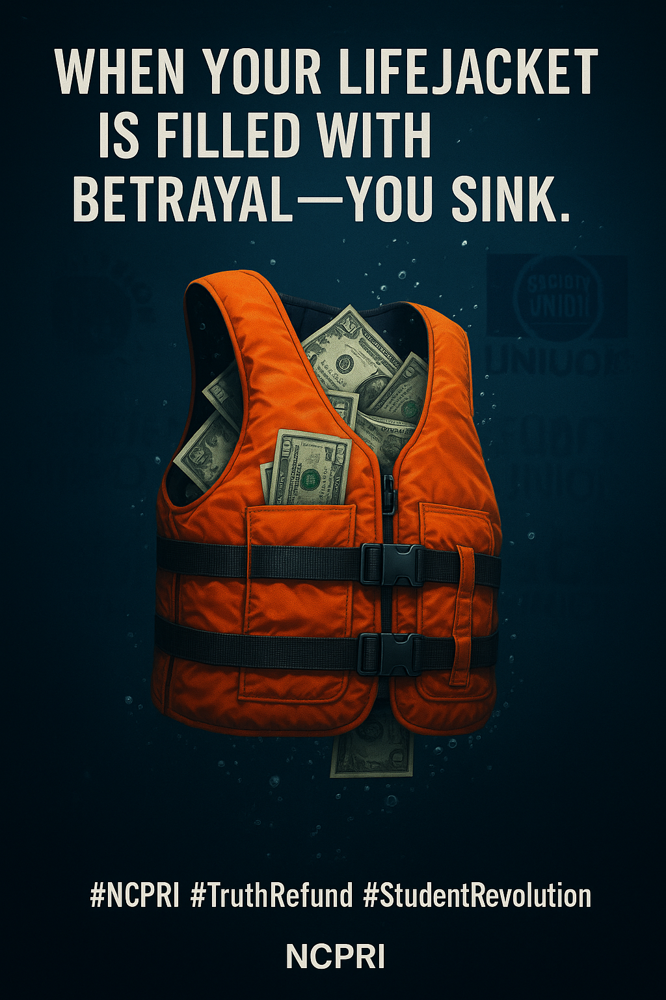

# NCPRI Letter — Demand for Funding Reallocation

This letter outlines the failure of university student unions to protect student interests and proposes the immediate redirection of compulsory union funding toward an independent student-led council: the National Council for PhD Candidate Protection & Research Integrity (NCPRI).

## Summary

- End compulsory union funding
- Give students a choice: Union or NCPRI
- Launch a protected, transparent student defense fund
- Build an international advocacy body from the ground up

**For the students. By the students. Without compromise.**

---

> Every dollar given to a union that betrays its students is a dollar of lifeblood drained from the future of higher education.
> It is time to cut off the supply. It is time to build anew.

